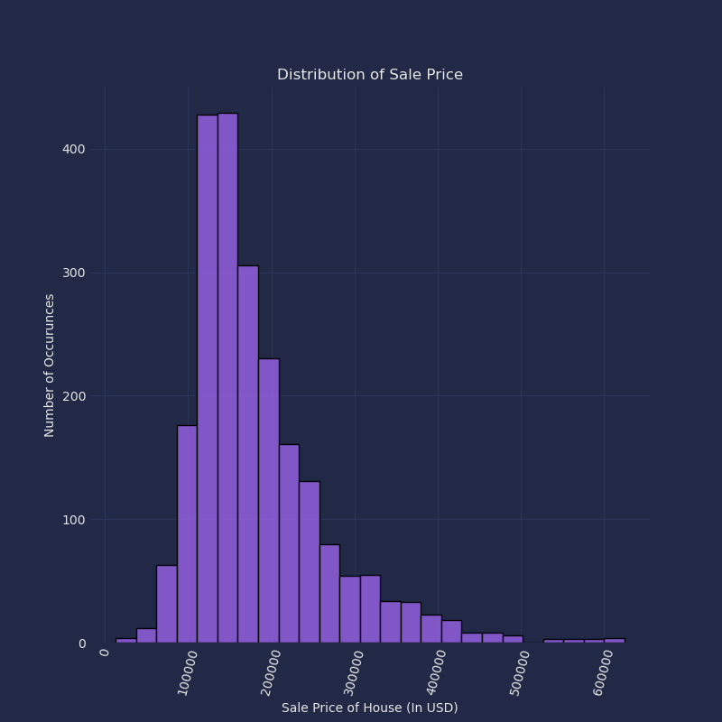

# Housing Price Predictions
## Problem Statement
For this analysis, I had to create a ML model in order to predict the cost of house using a couple of features. This can help with a few things. It could help real-estate investors with developing strategies on where to focus there money, it could help Mortgage lenders asses the risk f new loans, and it could even be used as a means to help Property tech business such as Zillow create better and more accurate predictions on what the cost of a house wil be within a given area. my analysis of the data that I have, the Iowa Ames Housing data, is going to be helpful in driving these decisions as it comes up with valuable and accurate predictions, while also showcasing how the difference in priorities within suburban areas can alter the price further
## Data Dictionary
| Column Name | Description |
|-------------|-------------|
|Order| Observation number|
|PID Parcel| identification number  - can be used with city web site for parcel review.| 
|MS SubClass| Identifies the type of dwelling involved in the sale.|	
|MS Zoning| Identifies the general zoning classification of the sale.|
|Lot Frontage| Linear feet of street connected to property|
|Lot Area| Lot size in square feet|
|Street| Type of road access to property|
|Alley| Type of alley access to property|
|Lot Shape| General shape of property|
|Land Contour| Flatness of the property|
|Utilities| Type of utilities available|
|Lot Config| Lot configuration|
|Land Slope| Slope of property|
|Neighborhood| Physical locations within Ames city limits (map available)|
|Condition 1| Proximity to various conditions|
|Condition 2| Proximity to various conditions (if more than one is present)|
|Bldg Type| Type of dwelling|
|House Style| Style of dwelling|
|Overall Qual| Rates the overall material and finish of the house|
|Overall Cond| Rates the overall condition of the house|
|Year Built| Original construction date|
|Year Remod/Add| Remodel date (same as construction date if no remodeling or additions)|
|Roof Style| Type of roof|
|Roof Matl| Roof material|
|Exterior 1| Exterior covering on house|
|Exterior 2| Exterior covering on house (if more than one material)|
|Mas Vnr Type| Masonry veneer type|
|Mas Vnr Area| Masonry veneer area in square feet|
|Exter Qual| Evaluates the quality of the material on the exterior|
|Exter Cond| Evaluates the present condition of the material on the exterior|
|Foundation| Type of foundation|
|Bsmt Qual| Evaluates the height of the basement|
|Bsmt Cond| Evaluates the general condition of the basement|
|Bsmt Exposure| Refers to walkout or garden level walls|
|BsmtFin Type 1| Rating of basement finished area|
|BsmtFin SF 1| Type 1 finished square feet|
|BsmtFinType 2| Rating of basement finished area (if multiple types)|
|BsmtFin SF 2| Type 2 finished square feet|
|Bsmt Unf SF| Unfinished square feet of basement area|
|Total Bsmt SF| Total square feet of basement area|
|Heating| Type of heating|
|HeatingQC| Heating quality and condition|
|Central Air| Central air conditioning|
|Electrical| Electrical system|
|1st Flr SF| First Floor square feet|
|2nd Flr SF| Second floor square feet|
|Low Qual Fin SF| Low quality finished square feet (all floors)|
|Gr Liv Area| Above grade (ground) living area square feet|
|Bsmt Full Bath| Basement full bathrooms|
|Bsmt Half Bath| Basement half bathrooms|
|Full Bath| Full bathrooms above grade|
|Half Bath| Half baths above grade|
|Bedroom| Bedrooms above grade (does NOT include basement bedrooms)|
|Kitchen| Kitchens above grade|
|KitchenQual| Kitchen quality|
|TotRmsAbvGrd| Total rooms above grade (does not include bathrooms)|
|Functional| Home functionality (Assume typical unless deductions are warranted)|
|Fireplaces| Number of fireplaces|
|FireplaceQu| Fireplace quality|
|Garage Type| Garage location|
|Garage Yr Blt| Year garage was built|
|Garage Finish| Interior finish of the garage|
|Garage Cars| Size of garage in car capacity|
|Garage Area| Size of garage in square feet|
|Garage Qual| Garage quality|
|Garage Cond| Garage condition|
|Paved Drive| Paved driveway|
|Wood Deck SF| Wood deck area in square feet|
|Open Porch SF| Open porch area in square feet|
|Enclosed Porch| Enclosed porch area in square feet|
|3-Ssn Porch| Three season porch area in square feet|
|Screen Porch| Screen porch area in square feet|
|Pool Area| Pool area in square feet|
|Pool QC| Pool quality|
|Fence| Fence quality|
|Misc Feature| Miscellaneous feature not covered in other categories|
|Misc Val| $Value of miscellaneous feature|
|Mo Sold| Month Sold (MM)|
|Yr Sold| Year Sold (YYYY)|
|Sale Type| Type of sale|
|Sale Condition| Condition of sale|
|SalePrice| Sale price $$|
## Executive Summary
### Data Cleaning Steps
#### Step 1: Handling Object Value Types
I handeled missing values in a couple of different ways within this dataset. 
#### 1st Method: Using the `.astype()` function...
1. selected the column I was trying to impute (like the "Central Air" column)
2. selected instances within that column that had "Y" by using the equality operator
3. converted the values of the pandas series from a object to a integer using the function `.astype()`
4. saved the changes within that column using column assignment (making the series itself a variable)
this method was very efficient, particularly at deealing with columns that had 2 values in order to make a binary column
#### 2nd Method: Using the `.replace()` function (in two ways)...
I implemented the replace method in two different ways...
#### First Method
1. created a variable, one was a list of the object values of a specific column, and the other was a list of the numerical values that I was replacing them with
2. I selected the specific column from the dataframe that I was trying to impute those values with
3. using the `to_replace` parameter within the replace function, I set it to the variable of the list of the objects within that column
4. using the `value` parameter within the replace function, I set it to the variable of the list of the numerical values that I am trying to impute it with
5. saved the changes within that column using column assignment (making the series itself a variable)
6. If the column still had missing values, I imputed them using `fillna()`, as they were not specifically errors, but just a sign that the house didn't have that particular feature
7. saved the changes within that column again using column assignment if I had to fill missing values
#### Second Method
1. I selected the specific column from the dataframe that I was trying to impute
2. using the replace function, I feed a dictionary, the keys are the names of the vlaues within the dataframe, the values are the values of the numbers I was trying to impute
3. saved the changes within that column using column assignment (making the series itself a variable) *these had no missing values, so I didn't have to impute them*
#### 3rd Method: Using the `.Categorical()` function...
1. I selected the `.Categorical()` function from the pandas library
2. I selected the specific column from the dataframe that I was trying to impute as the `values` parameter in the function
3. gave the parameter `categories` an array of all of the unique object values within that column of the dataframe
4. set the `ordered` parameter to `True` to ensure that the dummy variables would be in the order of the list in `categories`
5. saved the changes within that column using column assignment (making the series itself a variable)
6. I selected the specific column from the dataframe that I was trying to impute and used the attribute `.cat.codes` to turn the categorical values into dummy variables
7. saved the changes within that column again using column assignment
This was a nice breakthrough, as it allowed me to impute multiple values without needing to worry about the amount of Uniqiue values within that specific column, and it also automatically handled missing values within the dataset, meaning I didn't have to manually fill them.
#### Step 2: Handling Missing Values
To "handle" the missing values that were left within the dataset, I decided to drop them using the `.dropna()` function. This was because I was planning on doing machine learning, and imputting values with the median or mean would've just created synthetic data, which could've led to misleading results for the model.
#### Step 3: Saving the Cleaned Dataeset
1. created a subset of the dataset which I called `subset1`
2. used the function `.to_csv()` on the subset, along with a string of what I wanted the name of the csv to be (in this case, `'cleaned_ameshousing.csv'`)
This was to ensure that I wouldn't make any permanent changes to the original dataset
#### Step 4: Outlier Handling with IQR Method

### Key Visualizations
Include key visualizations that highlight important aspects of the data. Use graphs, charts, or any other visual representation to make your points.

#### Visualization 1: Distribution of Sale Price
A histogram that shows us the distributions of the housing prices (X) and the amount of occurences of that price (Y). important as it showcases what the typical prices of houses within the area would be.

#### Visualization 2: Heatmap of Correlation Coefficients and the Target
A heatmap that shows us all the correlation coefficients of each feature with the target we are trying to predict (SalePrice). Important as it showcasing many trends within Ames, Iowa, and it also will be helpful when chosinf features in order to predict the target variable.

#### Visualization 3: Barplot of the Sale Price and the Garage Type
A barplot which shows us the median sale price (Y) of a house by the garage type of the house (X) if it has a garage. Important as it shows us how the type of garage will affect the cost of a house. Built-in garages are the most expensive with lots of variability between the median and the quartiles of a data set (the error bars represent the IQR), while houses with no garages appear to be the cheapest, but car-port style garages have a smaller distribution when compared to houses with no garages.

#### Visualization 4: Barplot of the Sale Price and the Houses Quality
A barplot which shows us the median sale price (Y) by the houses quality, on a scale from 1 to 10 (X). Important as it shows how a houses overall quality **heavily** affects the price of a house. houses that have a quality of 10 are the most expensive at 450,000 dollars, with a large amount of variability (error bars represent the IQR), but a house with a quality rating of 1 is dramatically cheaper at 47,300 dollars and with a much tighter distribution.

#### Visualization 5: Regression Plot of the Sale Price and the Lot Area
A regression plot which showcases the relationship between the sale price of a house (X), and the lot area of a house (Y). Important as it shows us that the area of a house may not affect the price of a housee in this area as much as you may assume. A correlation coefficient of only 0.35, implies that there is a moderate relationship between the sale price and the lot area, so an increase in one of the two values may have an impact on eachother, but it is unlikely

.png)

#### Visualization 6: Regression Plot of the Sale Price and the Garage Area
A regression plot which showcases the relationship between the sale price of the house (X) and the garage area of a house (Y). Important as it shows that the area of the garage has a pretty stron relationship with the sale price. It is escpicially when taking into account the previous graph, as the correlation coefficient of this graph being 0.614 implies a deffinate stronger relationship compared to the previous regression plot. It gives us insights into what the people of Ames, Iowa, specifically look for when buyin a house.

.png)

## Model Performance
### Model Selection
The model type that I chose for this analysis is the Linear Regression model, as I want to more easily explain the cause and effect of the features and how they affect the target variable.  
### Evaluation Metrics

| Model             | RMSE     | R²       |
|-------------------|----------|----------|
| Model 1           | NaN  | 0.798  |
| Model 2           | NaN  | 0.811  |
| Model 3           | NaN  | 0.817  |
| Model 4           | NaN  | 0.818  |
| Model 5           | NaN  | 0.831  |
| Model 6           | NaN  | 0.831  |
| Model 7           | NaN  | 0.814  |
| Model 8           | NaN  | 0.831  |
| Model 9           | 34861.48  | 0.832  |

## Conclusions/Recommendations
Summarize the main findings from your analysis. If applicable, provide recommendations based on the insights gained from the data.